# Project Documentation: PERN Stack E-commerce Application

## Overview
This project is my first full-fledged full-stack application developed using the PERN stack, comprising PostgreSQL, Express.js, React.js, and Node.js. The primary objective of this project was to apply my fundamental and theoretical knowledge of these technologies into a practical, real-world application. Through the development of this e-commerce platform, I aimed to enhance my understanding of full-stack development and learn how to solve common challenges associated with building such applications.

The project is structured into two main parts: the client side and the server side. The client side is built using React and styled with Tailwind CSS, initiated with Vite. The server side is constructed with Node.js and Express.js, incorporating JWT authentication for authenticating users.

## Client Side

### Overview
The client side of the application is designed to offer an interactive and minimalistic user interface. It manages API calls to interact with the server and handles JSON data to present it in a user-friendly manner. The application supports various features such as user registration, login, product management, cart functionality, and order history.

### Project Structure
The client-side code is encapsulated in the `App.jsx` file, which uses React Router for navigation. Here is the key code snippet from `App.jsx`:

```jsx
import { BrowserRouter, Routes, Route, ScrollRestoration } from "react-router-dom"
import { useState, useEffect } from "react";
import Home from "./components/Home";
import Products from "./components/Products";
import HeaderFooter from "./components/HeaderFooter";
import Register from "./components/Register";
import Login from "./components/Login";
import UserProfile from "./components/UserProfile";
import ProductPage from "./components/ProductPage";
import ScrollToTop from "./components/ScrollToTop";
import NotFound from "./components/NotFound";

function App() {
  let userStatus = false;
  const accessToken = localStorage.getItem('accessToken');
  if (accessToken !== null) {
    userStatus = true;
  }

  history.scrollRestoration = "manual";

  return (
    <>
      <BrowserRouter>
        <ScrollToTop />
        <Routes>
          <Route path='/' element={<HeaderFooter userStatus={userStatus}/>}>
            <Route path='/' element={<Home />}></Route>
            <Route path='/products' element={<Products />}></Route>
            <Route path='/products/:productId' element={<ProductPage />}></Route>
            <Route path='/register'
              element={
                <Login userStatus={userStatus}>
                  <Register />
                </Login>
              }>
            </Route>
            <Route path='/user/profile' element={<UserProfile userStatus={userStatus}/>}></Route>
            <Route path='*' element={<NotFound />}></Route>
          </Route>
        </Routes>
      </BrowserRouter>
    </>
  )
}

export default App;
```

### Key Components
- **Home**: The landing page of the application.
- **Products**: Displays a list of available products.
- **HeaderFooter**: A shared layout component that includes the header and footer.
- **Register**: A form for new users to register.
- **Login**: Allows existing users to log in.
- **UserProfile**: Displays the logged-in user's profile.
- **ProductPage**: Shows details of a selected product.
- **ScrollToTop**: Ensures the page scrolls to the top when navigating between routes.
- **NotFound**: A 404 page for undefined routes.

### Styling
The styling of the client side is managed using Tailwind CSS, with additional customizations provided through a Tailwind configuration file and custom CSS for specific preferences. I also leveraged the DaisyUI component library to streamline the styling process.

## Server Side

### Overview
The server side is set up using Node.js and Express.js. It handles API requests, manages the PostgreSQL database, and implements JWT authentication for secure user management. The server is also responsible for processing user actions such as registration, login, product management, and order handling.

### Project Structure
The server side includes various routes and controllers to manage different API endpoints. Here are some of the key functionalities implemented:

- **User Registration and Authentication**: Utilizes bcrypt for password hashing and JWT for authentication.
- **Product Management**: Allows users to upload and delete products.
- **Cart Functionality**: Manages the user's cart, including adding and removing items.
- **Order History**: Tracks user purchases and displays their order history.

### Key Technologies and Packages
- **Express.js**: A web framework for building the server and handling routing.
- **PostgreSQL**: The relational database used to store application data.
- **JWT**: For secure user authentication.
- **Bcrypt**: For hashing and verifying user passwords.
- **Multer**: For handling file uploads.
- **Cors**: To handle cross-origin requests.

### Features
1. **User Registration and Login**: Users can create accounts and log in securely.  
2. **Product Management**: Users can upload new products and delete products.  
3. **Cart Functionality**: Users can add items to their cart, view their cart, and manage cart items.  
4. **Order History**: Users can view their past orders and details of their purchases.  
5. **Product Filtering**: Users can search for products and filter them by price range, sorting by low to high or high to low.
6. **Interactive UI**: Designed to be minimalistic and user-friendly.
7. **API Integration**: Fetches and handles JSON data from the server to display products and manage user interactions.
8. **User Authentication**: Manages user sessions using JWT tokens stored in localStorage.

## Learning Outcomes
This project has been instrumental in solidifying my understanding of full-stack development and the technologies involved in building a comprehensive web application. Key learnings include:

- **Database Management**: Designing and managing a relational database, including creating tables and writing efficient queries.
- **User Authentication**: Implementing secure user authentication using JWT and bcrypt.
- **API Development**: Building a robust API with Express.js to handle various client requests.
- **State Management**: Utilizing React's state management and hooks to create dynamic and responsive components.
- **Styling**: Applying Tailwind CSS and custom styles to create a visually appealing user interface.
- **Version Control**: Using Git and GitHub for version control, facilitating collaboration and code management.

## Conclusion
This e-commerce application serves as a testament to my ability to develop a full-stack application using the PERN stack. It highlights my skills in both front-end and back-end development, as well as my capacity to solve real-world problems through practical implementation. This project has provided me with invaluable experience and knowledge that I will carry forward into future development endeavors. Ofcourse This application also has many room for improvements but I would like to work on other types of applications and softwares too. If you can any queries , feel free to [pdl.rishav88@gmail.com](mailto:pdl.rishav88@gmail.com) or [Message me on linkedIn](https://www.linkedin.com/in/poudelrishavz/).

## Screenshots
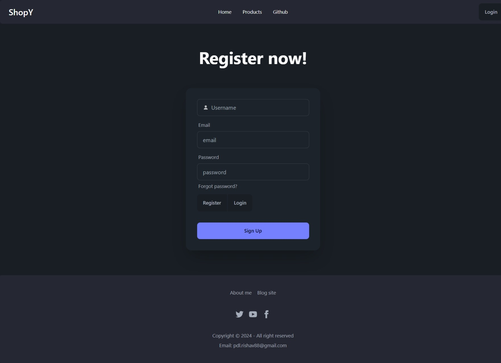
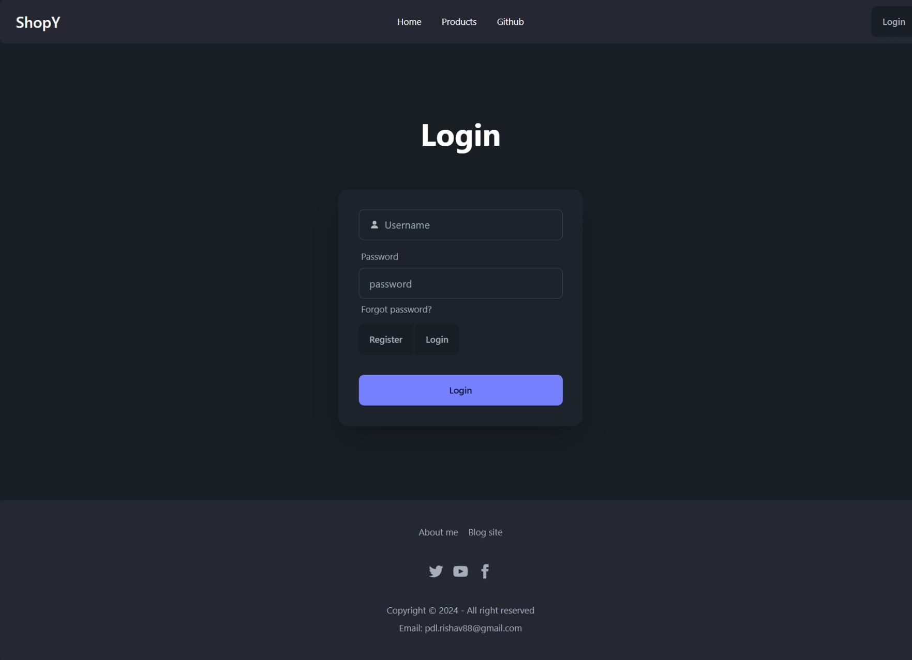
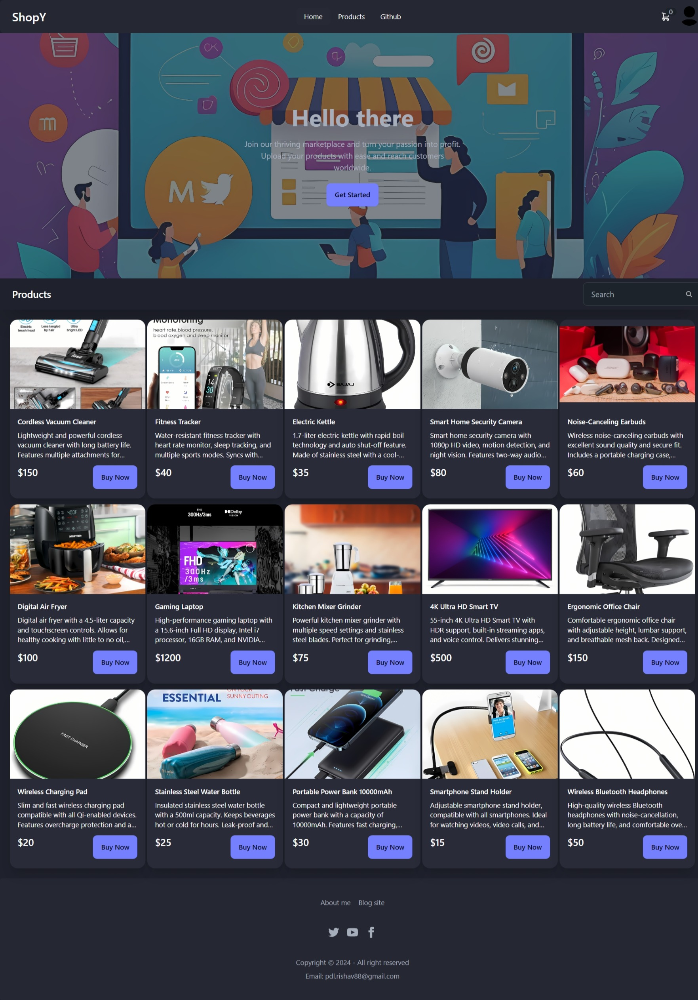
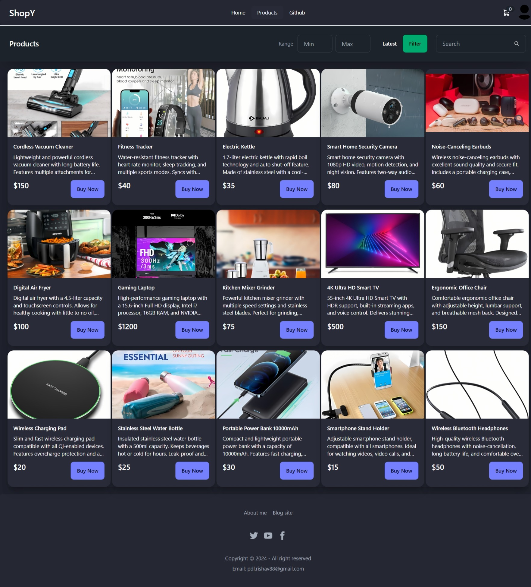
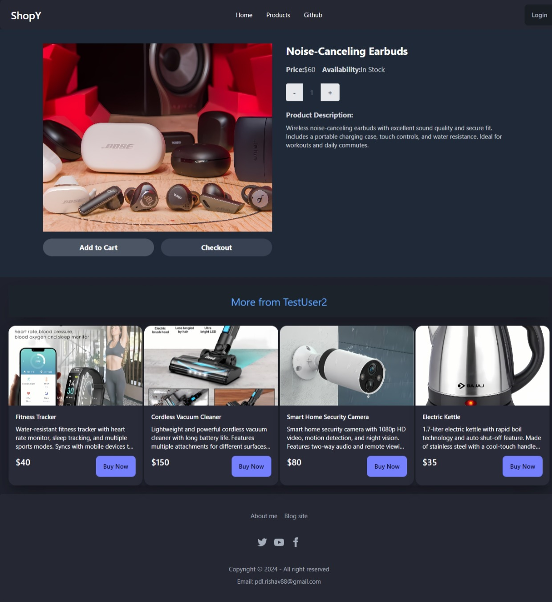
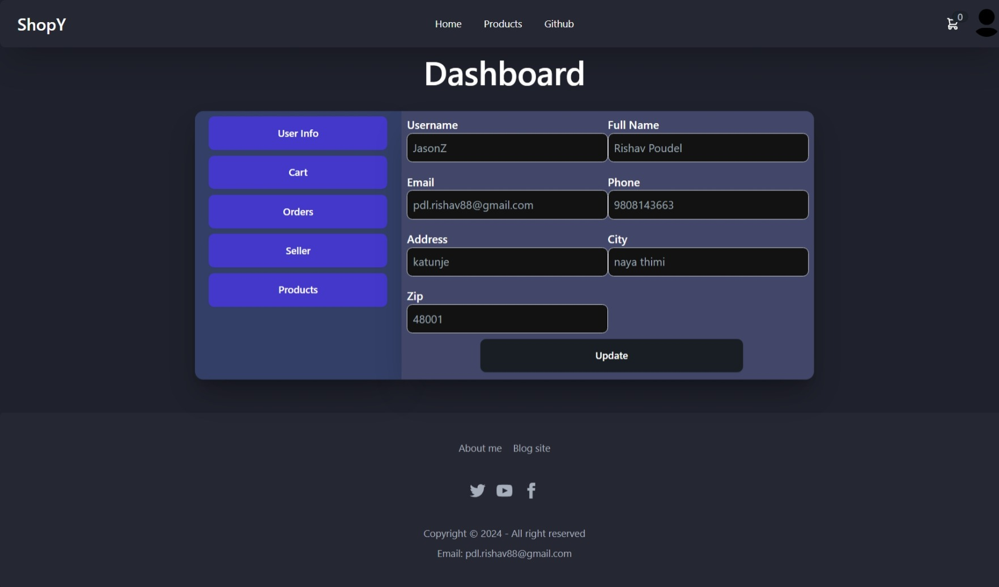
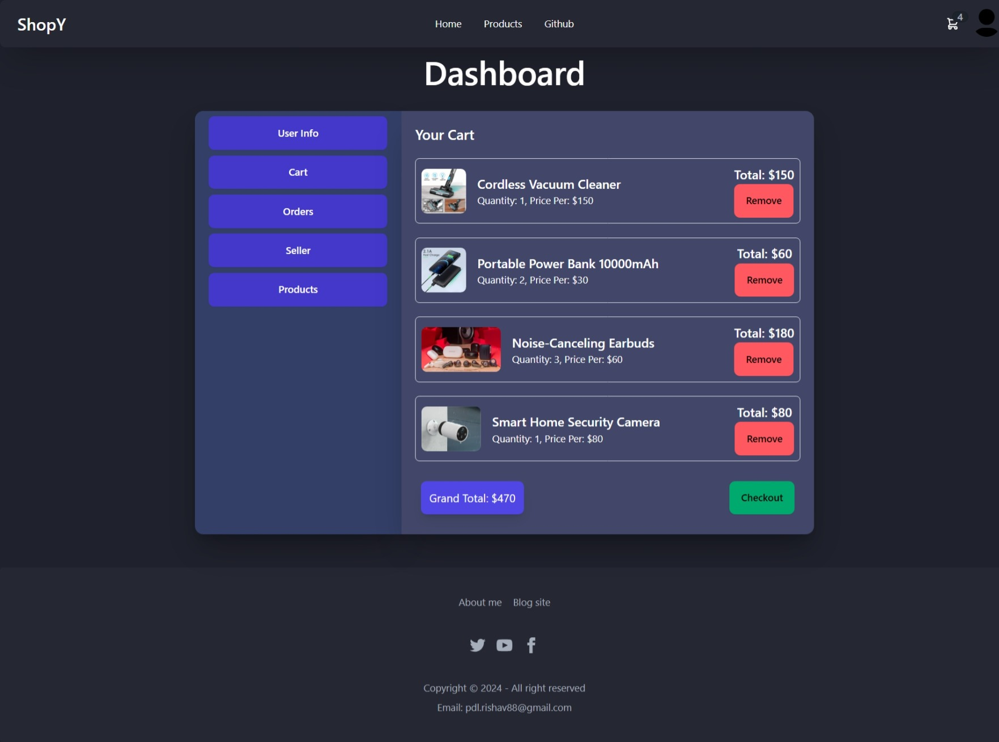
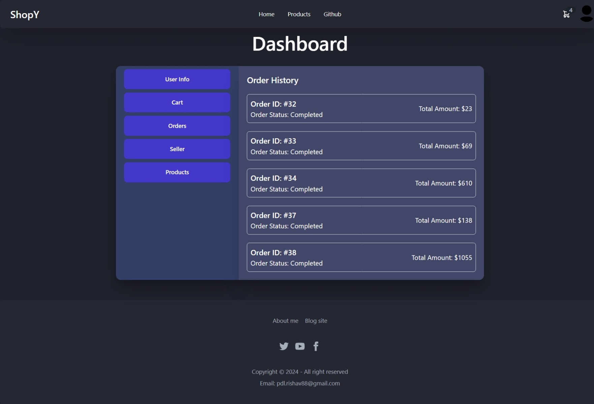
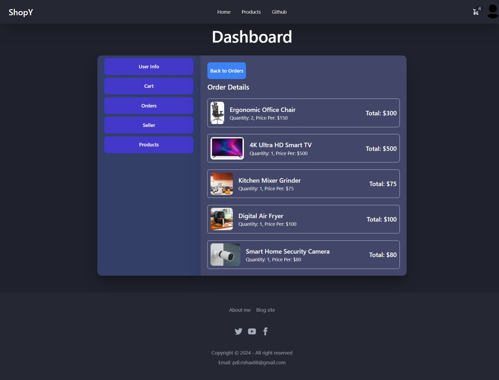
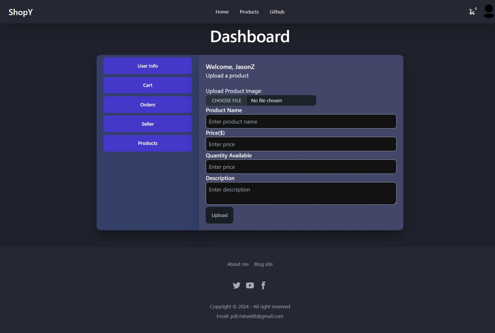
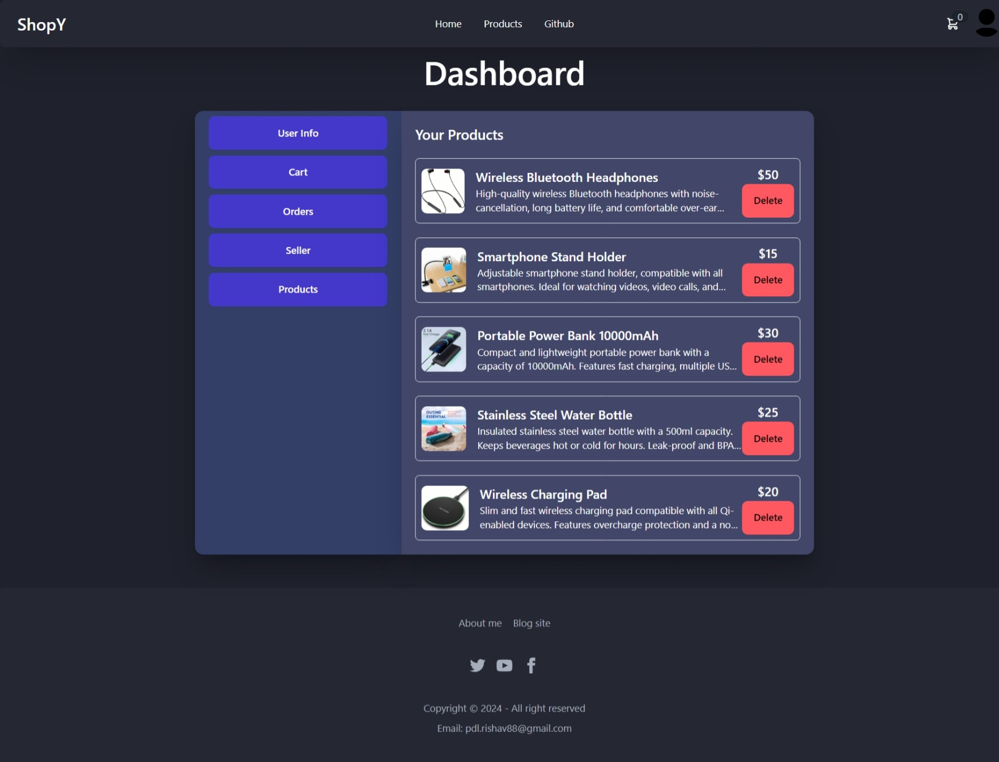